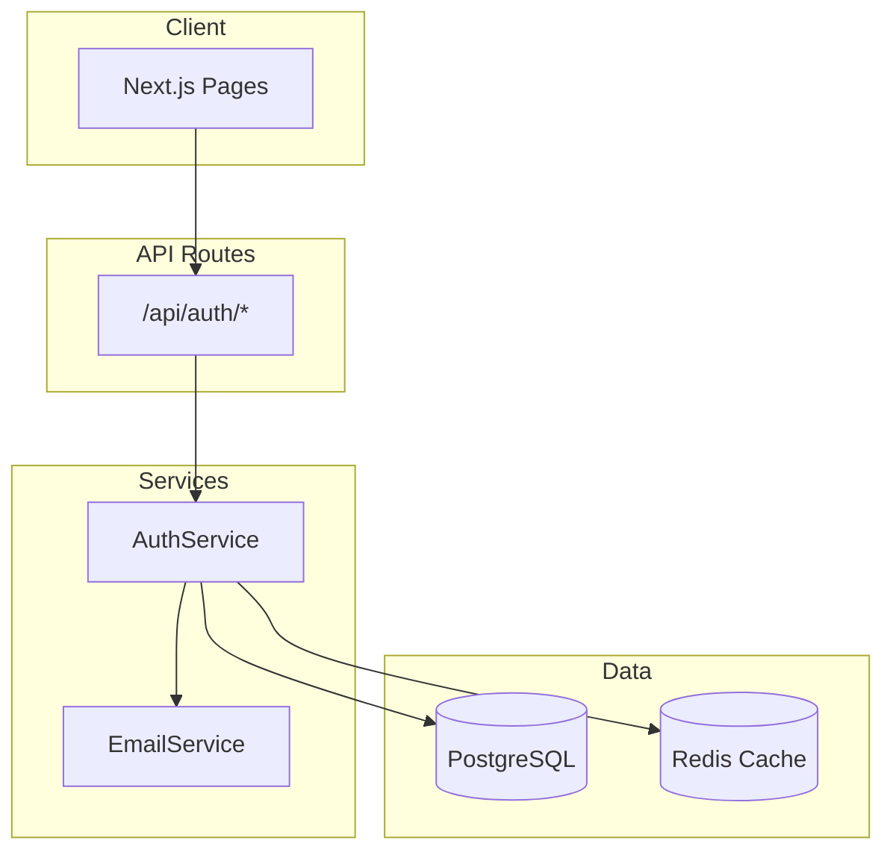

# /aidlc-design - Generate Design

Generate architecture and component design from approved requirements.

## What This Command Does

When you use `/aidlc-design`, the AI will:

1. **Load Context**
   - Read steering files (tech.md, structure.md)
   - Load requirements from current feature

2. **Generate Architecture**
   - Create high-level architecture overview
   - Design component interactions
   - Create Mermaid diagrams

3. **Design Components**
   - Define components and their responsibilities
   - Specify interfaces and contracts
   - Design data flow

4. **Design Data Models**
   - Define database schemas (if applicable)
   - Define TypeScript types/interfaces
   - Design API contracts

5. **Generate Diagrams**
   - Architecture diagram (Mermaid)
   - Component diagram
   - Sequence diagrams (for complex flows)
   - ERD (if database involved)

6. **Wait for Approval**
   - Present design for review
   - Allow modifications before saving

## Prerequisites

- Requirements file must exist (run `/aidlc-requirements` first)
- Located at `.cursor-kiro/specs/{feature-name}/requirements.md`

## Usage

### Basic Usage (Auto-detect Current Feature)
```
/aidlc-design
```

### Specify Feature
```
/aidlc-design --feature user-auth
```

### Design Specific Aspect
```
/aidlc-design --focus api
/aidlc-design --focus database
/aidlc-design --focus components
```

## Output

File created in `.cursor-kiro/specs/{feature-name}/design.md`

### Design Format

```markdown
# Design: [Feature Name]

## Architecture Overview

[Mermaid architecture diagram]

## Components

| Component | Responsibility | Dependencies |
|-----------|---------------|--------------|
| [name] | [what it does] | [what it needs] |

## Data Models

### Database Schema
[ERD or schema definition]

### TypeScript Types
[Type definitions]

## API Design

| Endpoint | Method | Request | Response |
|----------|--------|---------|----------|
| /api/... | POST | {...} | {...} |

## Sequence Diagrams

[Mermaid sequence diagrams for key flows]
```

## Example

### Input
```
/aidlc-design
```

### AI Response
```
📐 Generating Design...

🔍 Loading:
- Requirements: user-auth (3 FRs, 6 ACs)
- Tech: Next.js + Prisma + PostgreSQL

---

# Design: User Authentication

## Architecture Overview



## Components

| Component | Responsibility |
|-----------|---------------|
| AuthService | Handle authentication logic |
| EmailService | Send verification/reset emails |
| UserRepository | Database operations for users |
| TokenManager | JWT creation/validation |

## Data Models

### User Schema (Prisma)
```prisma
model User {
  id            String   @id @default(uuid())
  email         String   @unique
  passwordHash  String
  verified      Boolean  @default(false)
  createdAt     DateTime @default(now())
}
```

### TypeScript Types
```typescript
interface User {
  id: string;
  email: string;
  verified: boolean;
}

interface LoginRequest {
  email: string;
  password: string;
}

interface AuthResponse {
  user: User;
  accessToken: string;
}
```

## API Design

| Endpoint | Method | Description |
|----------|--------|-------------|
| /api/auth/register | POST | Create new user |
| /api/auth/login | POST | Authenticate user |
| /api/auth/forgot-password | POST | Request reset |
| /api/auth/reset-password | POST | Reset password |

---

[Approve] [Modify] [Add More Detail]
```

## Related Commands

| Command | Description |
|---------|-------------|
| `/aidlc-steering` | Setup project context |
| `/aidlc-requirements` | Generate requirements |
| `/aidlc-task` | Generate tasks from this design |

