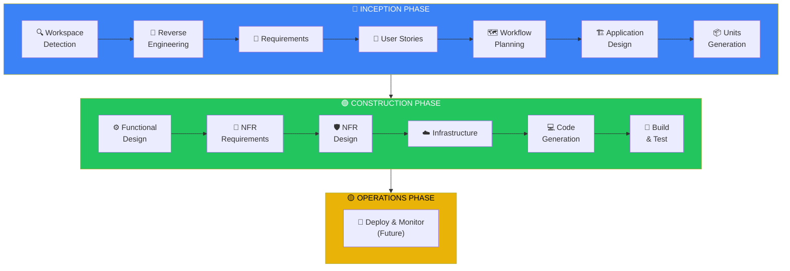
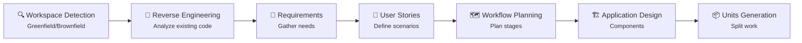
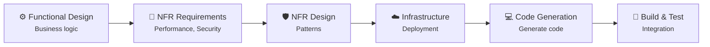
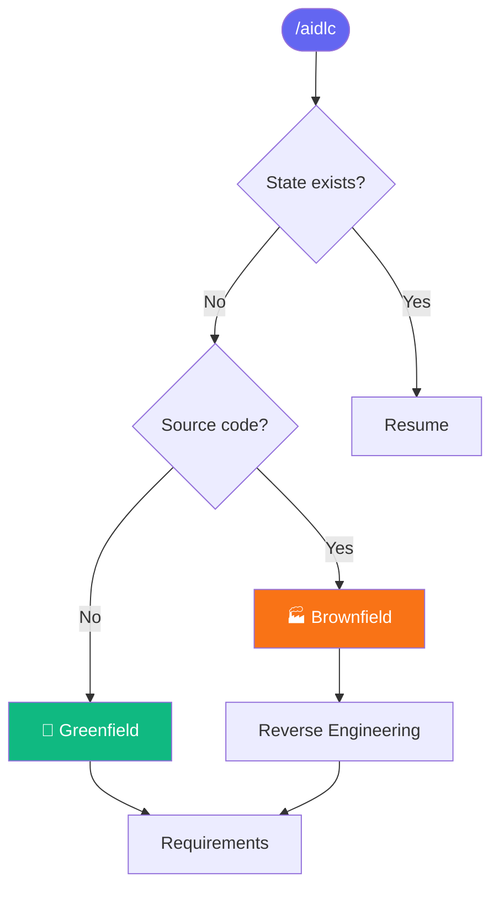

# AIDLC Command System for Cursor

ระบบ Custom Commands สำหรับ Cursor IDE ที่ใช้หลักการ **AI Development Life Cycle (AIDLC)**

## 📋 Overview

AIDLC Command System ช่วยให้คุณพัฒนาซอฟต์แวร์อย่างเป็นระบบโดยใช้ AI เป็นผู้ช่วย ครอบคลุมตั้งแต่การวิเคราะห์ความต้องการไปจนถึงการ generate code

```
🔵 INCEPTION    →  วิเคราะห์ + ออกแบบ (WHAT to build)
🟢 CONSTRUCTION →  สร้าง + ทดสอบ (HOW to build)
🟡 OPERATIONS   →  Deploy + Monitor (Future)
```

---

## 🚀 Quick Start

### 1. เปิด Cursor Chat

กด `Cmd+L` (Mac) หรือ `Ctrl+L` (Windows/Linux)

### 2. พิมพ์ `/` เพื่อดู Commands

Commands ทั้งหมดจะแสดงขึ้นมา

### 3. เริ่มต้นใช้งาน

```
/aidlc
```

AI จะเริ่ม workflow ให้อัตโนมัติ

---

## 📚 Available Commands

### Main Commands

| Command | Description |
|---------|-------------|
| `/aidlc` | 🏁 Main entry - เริ่มหรือ resume workflow |
| `/aidlc-init` | 📂 Initialize - สร้างโครงสร้าง AIDLC |
| `/aidlc-status` | 📊 Status - แสดงสถานะปัจจุบัน |
| `/aidlc-multi-repo` | 🔗 Multi-Repo - Configure related projects |

### 🔵 INCEPTION Commands

| Command | Description |
|---------|-------------|
| `/aidlc-reverse` | 🔍 Reverse Engineering - วิเคราะห์ code ที่มีอยู่ |
| `/aidlc-requirements` | 📝 Requirements - วิเคราะห์ความต้องการ |
| `/aidlc-stories` | 👤 User Stories - สร้าง user stories |
| `/aidlc-plan` | 🗺️ Planning - วางแผน workflow |
| `/aidlc-design` | 🏗️ Design - ออกแบบ components |
| `/aidlc-units` | 📦 Units - แบ่ง units of work |

### 🟢 CONSTRUCTION Commands

| Command | Description |
|---------|-------------|
| `/aidlc-functional` | ⚙️ Functional Design - ออกแบบ business logic |
| `/aidlc-nfr` | 📐 NFR - Non-functional requirements |
| `/aidlc-infra` | ☁️ Infrastructure - ออกแบบ infrastructure |
| `/aidlc-code` | 💻 Code Generation - generate code |
| `/aidlc-build` | 🔨 Build & Test - คำแนะนำ build และ test |

---

## 💡 Usage Examples

### เริ่มโปรเจกต์ใหม่

```
/aidlc
```

AI จะ:
1. ตรวจสอบ workspace (Greenfield หรือ Brownfield)
2. สร้างโครงสร้าง `aidlc-docs/`
3. เริ่ม Requirements Analysis

### วิเคราะห์ความต้องการพร้อม context

```
/aidlc-requirements Build a REST API for user authentication with OAuth2
```

### ดูสถานะปัจจุบัน

```
/aidlc-status
```

### Resume จากที่หยุดไว้

```
/aidlc
```

AI จะอ่าน state จาก `aidlc-docs/state/{branch}.md` และ resume จาก stage ล่าสุด

---

## 📁 Generated Structure

เมื่อใช้ AIDLC จะสร้างโครงสร้างนี้:

```
your-project/
├── .cursor/
│   └── commands/          # AIDLC commands (this folder)
├── aidlc-docs/            # AIDLC artifacts
│   ├── inception/
│   │   ├── plans/
│   │   ├── requirements/
│   │   ├── user-stories/
│   │   ├── reverse-engineering/
│   │   └── application-design/
│   ├── construction/
│   │   ├── plans/
│   │   ├── {unit-name}/
│   │   └── build-and-test/
│   ├── branches/          # Branch-based artifacts
│   │   └── {branch}/
│   │       ├── inception/
│   │       └── construction/
│   ├── state/             # Branch-based state tracking
│   │   └── {branch}.md
│   └── audit/             # Branch-based audit logs
│       └── {branch}.md
│       ├── audit-index.md
│       └── {branch}.md
└── [your source code]
```

---

## 🔄 Workflow Phases

### Complete AIDLC Workflow



### 🔵 INCEPTION Phase Details

**Focus**: กำหนดว่าจะสร้างอะไร (WHAT)



### 🟢 CONSTRUCTION Phase Details

**Focus**: กำหนดวิธีสร้าง (HOW)



### Decision Flow



---

## ⚙️ Configuration

### Project-Level Commands

Commands ใน `.cursor/commands/` จะใช้ได้เฉพาะ project นี้

### Global Commands (Optional)

Copy ไปยัง `~/.cursor/commands/` เพื่อใช้ได้ทุก project:

```bash
cp -r .cursor/commands/* ~/.cursor/commands/
```

---

## ❓ FAQ

### Commands ไม่แสดง?

1. ตรวจสอบว่าไฟล์อยู่ใน `.cursor/commands/`
2. **Restart Cursor IDE**

### ต้องการเริ่มใหม่ทั้งหมด?

```bash
rm -rf aidlc-docs/
/aidlc-init
```

### ใช้กับโปรเจกต์ที่มี code อยู่แล้ว?

ได้! AI จะตรวจจับเป็น **Brownfield** และเริ่ม Reverse Engineering

---

## 📖 Reference

- [Cursor Commands Documentation](https://cursor.com/docs/agent/chat/commands)
- AIDLC Rules: `.cursor/rules/aidlc-rules/`

---

## 📝 Version

| Version | Date | Changes |
|---------|------|---------|
| 1.4 | 2025-12-15 | Added multi-repository support |
| 1.3 | 2025-12-15 | Branch-based audit system |
| 1.2 | 2025-12-15 | CHANGELOG management |
| 1.1 | 2025-12-15 | Helper scripts, distribution guide |
| 1.0 | 2025-12-15 | Initial release |

