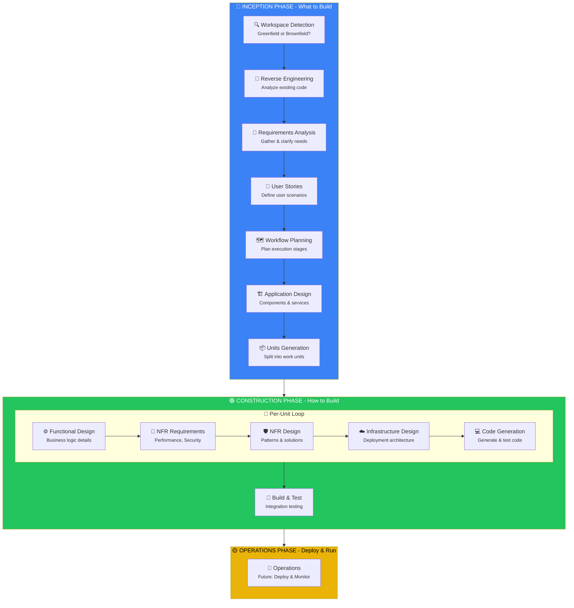

# AIDLC Command System for Cursor

<div align="center">

**ระบบ Custom Commands สำหรับ Cursor IDE**  
**ใช้หลักการ AI Development Life Cycle (AIDLC)**

[](https://cursor.com)
[](.cursor/commands/)
[](LICENSE)

</div>

---

## 🎯 What is AIDLC?

**AI Development Life Cycle (AIDLC)** คือ framework สำหรับพัฒนาซอฟต์แวร์โดยใช้ AI เป็นผู้ช่วย ครอบคลุม 3 phases:

| Phase | Focus | Description |
|-------|-------|-------------|
| 🔵 **INCEPTION** | WHAT | วิเคราะห์ความต้องการ + ออกแบบ |
| 🟢 **CONSTRUCTION** | HOW | Functional design + Code generation |
| 🟡 **OPERATIONS** | RUN | Deploy + Monitor (future) |

---

## 🔄 AIDLC Workflow Diagram

### Complete Workflow Overview



### Decision Flow Diagram

```mermaid
flowchart TD
    START(["/aidlc"]) --> CHECK{state/{branch}.md<br/>exists?}
    
    CHECK -->|No| WD["Workspace Detection"]
    CHECK -->|Yes| RESUME["Resume from<br/>last stage"]
    
    WD --> SCAN{Existing<br/>source code?}
    
    SCAN -->|Yes| BROWN["🏭 Brownfield<br/>→ Reverse Engineering"]
    SCAN -->|No| GREEN["🌱 Greenfield<br/>→ Requirements"]
    
    BROWN --> RE["Reverse Engineering"]
    RE --> RA["Requirements Analysis"]
    GREEN --> RA
    
    RA --> COMPLEX{Request<br/>complexity?}
    
    COMPLEX -->|Simple| SKIP_US["Skip User Stories"]
    COMPLEX -->|Complex| US["User Stories"]
    
    US --> WP["Workflow Planning"]
    SKIP_US --> WP
    
    WP --> ASSESS{Stages<br/>needed?}
    
    ASSESS --> AD["Application Design<br/>(if new components)"]
    ASSESS --> UG["Units Generation<br/>(if multiple units)"]
    
    AD --> UG
    UG --> LOOP["Per-Unit Construction"]
    
    LOOP --> BT["Build & Test"]
    BT --> DONE([✅ Complete])
    
    style START fill:#6366f1,color:#fff
    style DONE fill:#22c55e,color:#fff
    style BROWN fill:#f97316,color:#fff
    style GREEN fill:#10b981,color:#fff
```

---

## 📦 Installation

### Option 1: ใช้ Script (แนะนำ) ✨

```bash
# Clone repo
git clone <repo-url> aidlc-template
cd aidlc-template

# ติดตั้งไปยัง project
./scripts/install-to-project.sh /path/to/your/project

# หรือ ติดตั้งแบบ Global
./scripts/install-global.sh
```

### Option 2: Copy ทั้งโฟลเดอร์ `.cursor/`

```bash
# Clone หรือ download repo นี้
git clone <repo-url> aidlc-template

# Copy ไปยัง project ที่ต้องการใช้
cp -r aidlc-template/.cursor/ your-project/.cursor/
```

### Option 3: Global Installation (ใช้ได้ทุก project)

```bash
# Copy commands ไปที่ global folder
cp -r .cursor/commands/* ~/.cursor/commands/

# Copy rules ไปที่ global folder
mkdir -p ~/.cursor/rules/
cp -r .cursor/rules/* ~/.cursor/rules/
```

> ⚠️ **หมายเหตุ**: หลังจาก copy แล้ว **ต้อง Restart Cursor IDE** เพื่อให้ commands แสดง

---

## 🚀 Quick Start

### 1. เปิด Cursor Chat

กด `Cmd+L` (Mac) หรือ `Ctrl+L` (Windows)

### 2. เริ่มใช้งาน

```
/aidlc
```

AI จะเริ่ม workflow ให้อัตโนมัติ และ progress ผ่าน stages ต่างๆ ตาม context ของ request

---

## 📋 Available Commands

| Command | Description |
|---------|-------------|
| `/aidlc` | 🏁 **Main entry** - เริ่ม, resume, หรือทำงานทุกอย่าง |
| `/aidlc-status` | 📊 **Status** - แสดงสถานะปัจจุบัน |
| `/aidlc-changelog` | 📝 **Changelog** - อัพเดต CHANGELOG.md เมื่อพร้อม |
| `/aidlc-multi-repo` | 🔗 **Multi-Repo** - Configure related projects (advanced) |

### ทำไมแค่ 4 Commands?

เพราะ **AIDLC core-workflow** จัดการทุกอย่างอัตโนมัติ:
- ✅ Auto-detect Greenfield/Brownfield
- ✅ Auto-progress ผ่าน stages ที่จำเป็น
- ✅ Auto-skip stages ที่ไม่จำเป็น
- ✅ Resume จาก state file เมื่อ session ใหม่
- ✅ Context-aware execution ตาม request
- ✅ Fix/Resume Flow สำหรับ post-completion errors

**ไม่จำเป็นต้องมี command แยกสำหรับแต่ละ stage!**

---

## 📁 Project Structure

### Distribution Contents

```
aidlc-command-cursor/
├── .cursor/
│   ├── commands/                 # 📌 4 AIDLC Commands
│   │   ├── aidlc.md              # Main entry - ทำทุกอย่าง
│   │   ├── aidlc-status.md       # Status check
│   │   ├── aidlc-changelog.md    # Changelog management
│   │   ├── aidlc-multi-repo.md   # Multi-repo config
│   │   └── README.md             # Commands documentation
│   └── rules/
│       ├── conventional-commits.mdc  # Git commit message rules
│       └── aidlc-rules/              # 📚 AIDLC Reference Rules
│           ├── aws-aidlc-rules/
│           │   └── core-workflow.mdc     # Main workflow orchestrator
│           └── aws-aidlc-rule-details/
│               ├── common/               # Shared utilities (15 files)
│               │   ├── audit-management.md
│               │   ├── branch-artifacts.md
│               │   ├── changelog-management.md
│               │   ├── content-validation.md
│               │   ├── depth-levels.md
│               │   ├── error-handling.md
│               │   ├── multi-repo-context.md
│               │   ├── overconfidence-prevention.md
│               │   ├── process-overview.md
│               │   ├── question-format-guide.md
│               │   ├── session-continuity.md
│               │   ├── state-management.md
│               │   ├── terminology.md
│               │   ├── welcome-message.md
│               │   └── workflow-changes.md
│               ├── inception/            # INCEPTION phase rules (7 files)
│               │   ├── workspace-detection.md
│               │   ├── reverse-engineering.md
│               │   ├── requirements-analysis.md
│               │   ├── user-stories.md
│               │   ├── workflow-planning.md
│               │   ├── application-design.md
│               │   └── units-generation.md
│               ├── construction/         # CONSTRUCTION phase rules (6 files)
│               │   ├── functional-design.md
│               │   ├── nfr-requirements.md
│               │   ├── nfr-design.md
│               │   ├── infrastructure-design.md
│               │   ├── code-generation.md
│               │   └── build-and-test.md
│               └── operations/           # OPERATIONS phase rules (1 file)
│                   └── operations.md     # Placeholder for future
├── scripts/                      # 🛠️ Helper Scripts
│   ├── install-global.sh         # ติดตั้งแบบ Global
│   ├── install-to-project.sh     # ติดตั้งไปยัง project
│   └── prepare-distribution.sh   # เตรียมสำหรับแจกจ่าย
├── CHANGELOG.md                  # Version history
├── DISTRIBUTION.md               # 📦 Distribution guide
└── README.md
```

### Generated Structure (เมื่อใช้ AIDLC)

เมื่อ run `/aidlc` จะสร้าง `aidlc-docs/` folder:

```
your-project/
├── .cursor/                   # Commands & Rules
├── aidlc-docs/               # 📝 Generated artifacts
│   ├── state/                # Branch-based state tracking
│   │   ├── state-index.md
│   │   └── {branch}.md
│   ├── audit/                # Branch-based audit logs
│   │   ├── audit-index.md
│   │   ├── archived/         # Merged branch audits
│   │   └── {branch}.md
│   └── branches/             # Branch-based artifacts
│       ├── branches-index.md
│       ├── archived/         # Merged branch artifacts
│       └── {branch}/
│           ├── inception/
│           │   ├── plans/
│           │   ├── reverse-engineering/   # Brownfield only
│           │   ├── requirements/
│           │   ├── user-stories/
│           │   └── application-design/
│           └── construction/
│               ├── plans/
│               ├── {unit-name}/
│               │   └── functional-design/
│               └── build-and-test/
└── [your source code]
```

---

## 💡 Usage Examples

### เริ่มโปรเจกต์ใหม่ (Greenfield)

```
/aidlc สร้าง REST API สำหรับ user authentication
```

### ทำงานต่อจากที่หยุดไว้

```
/aidlc
```

AI จะอ่าน state จาก `state/{branch}.md` และ resume จาก stage ล่าสุด

### ดูสถานะปัจจุบัน

```
/aidlc-status
```

### อัพเดต CHANGELOG เมื่อพร้อม

```
/aidlc-changelog
```

### ข้ามไป stage ที่ต้องการ

```
/aidlc skip to code generation
```

### Re-run stage ใดๆ

```
/aidlc re-run requirements analysis
```

### ใช้กับโปรเจกต์ที่มี code อยู่แล้ว (Brownfield)

```
/aidlc
```

AI จะตรวจจับและเริ่ม Reverse Engineering อัตโนมัติ

### Fix/Resume Flow (Post-Completion Errors)

เมื่อ workflow เสร็จแล้วแต่พบ error:

```
/aidlc fix null pointer in UserService
```

AI จะ skip stages ไปแก้ไข code โดยตรง

---

## 🔗 Multi-Repository Projects

AIDLC รองรับโปรเจกต์ที่แยก Frontend, Backend, Jobs ออกจากกัน:

### Quick Setup

```
/aidlc-multi-repo
```

### Configuration

สร้าง `aidlc-docs/related-projects.md`:

```markdown
# Related Projects

| Project | Type | Path | Description |
|---------|------|------|-------------|
| my-frontend | Frontend | ../my-frontend | React SPA |
| my-backend | Backend | ../my-backend | Node.js API |
| my-jobs | Jobs | ../my-jobs | Background workers |
```

### How It Works

1. **Requirements**: แสดง impact ต่อทุก project
2. **Code Generation**: สร้าง cross-repo change notes
3. **Build & Test**: รวม integration test instructions

---

## 👥 Team Collaboration

### Branch-Based System

AIDLC ใช้ระบบ tracking แยกตาม Git branch:

```
aidlc-docs/
├── state/
│   └── {branch}.md      # State per branch
├── audit/
│   └── {branch}.md      # Audit per branch
└── branches/
    └── {branch}/        # Artifacts per branch
        ├── inception/
        └── construction/
```

**Benefits**:
- ✅ แยก state/audit/artifacts ตาม feature branch
- ✅ ง่ายต่อการ review ใน PR
- ✅ ทีมทำงานพร้อมกันได้โดยไม่ conflict
- ✅ Archive อัตโนมัติเมื่อ merge

### แนะนำสำหรับทีม

1. **Commit `aidlc-docs/`** ลง repo เพื่อให้ทีมเห็น artifacts ร่วมกัน
2. **ใช้ feature branch** เพื่อให้ logs และ artifacts แยกกัน
3. **Review `aidlc-docs/` ใน PR** เพื่อดู requirements และ design

---

## ❓ Troubleshooting

### Commands ไม่แสดงใน Cursor?

1. ตรวจสอบว่า `.cursor/commands/` อยู่ที่ project root
2. **Restart Cursor IDE** (ปิดแล้วเปิดใหม่)
3. ลอง reload window: `Cmd+Shift+P` → "Reload Window"

### ต้องการเริ่มใหม่ทั้งหมด?

```bash
rm -rf aidlc-docs/
/aidlc
```

### Error: "Cannot find rule file"?

ตรวจสอบว่า copy ทั้ง `.cursor/commands/` และ `.cursor/rules/` แล้ว

### ต้องการทำเฉพาะ stage ไหน?

แค่บอก AI ตรงๆ ใน `/aidlc` command เลย เช่น:
- "ทำ requirements analysis เท่านั้น"
- "skip ไป code generation"
- "re-run user stories"

---

## 🔗 Links

- 📖 [Cursor Commands Docs](https://cursor.com/docs/agent/chat/commands)
- 📂 [Commands README](.cursor/commands/README.md)
- 📋 [Changelog](CHANGELOG.md)
- 📦 [Distribution Guide](DISTRIBUTION.md)

---

## 📝 Version History

| Version | Date | Changes |
|---------|------|---------|
| 2.2 | 2025-12-15 | Added `/aidlc-changelog` command for user-triggered CHANGELOG updates |
| 2.1 | 2025-12-15 | Added Fix/Resume Flow for post-completion errors |
| 2.0 | 2025-12-15 | **Simplified to 4 essential commands** - removed 12 stage-specific commands |
| 1.4 | 2025-12-15 | Added multi-repository support (frontend/backend/jobs) |
| 1.3 | 2025-12-15 | Branch-based state, audit, and artifacts system |
| 1.2 | 2025-12-15 | Added automatic CHANGELOG management for projects |
| 1.1 | 2025-12-15 | Added team collaboration docs, improved installation guide |
| 1.0 | 2025-12-15 | Initial release |

---

## 📄 License

MIT License - ใช้ได้อย่างอิสระ

---

<div align="center">

**Made with ❤️ using AIDLC**

*ระบบพัฒนาซอฟต์แวร์ด้วย AI อย่างมีระบบ*

</div>
