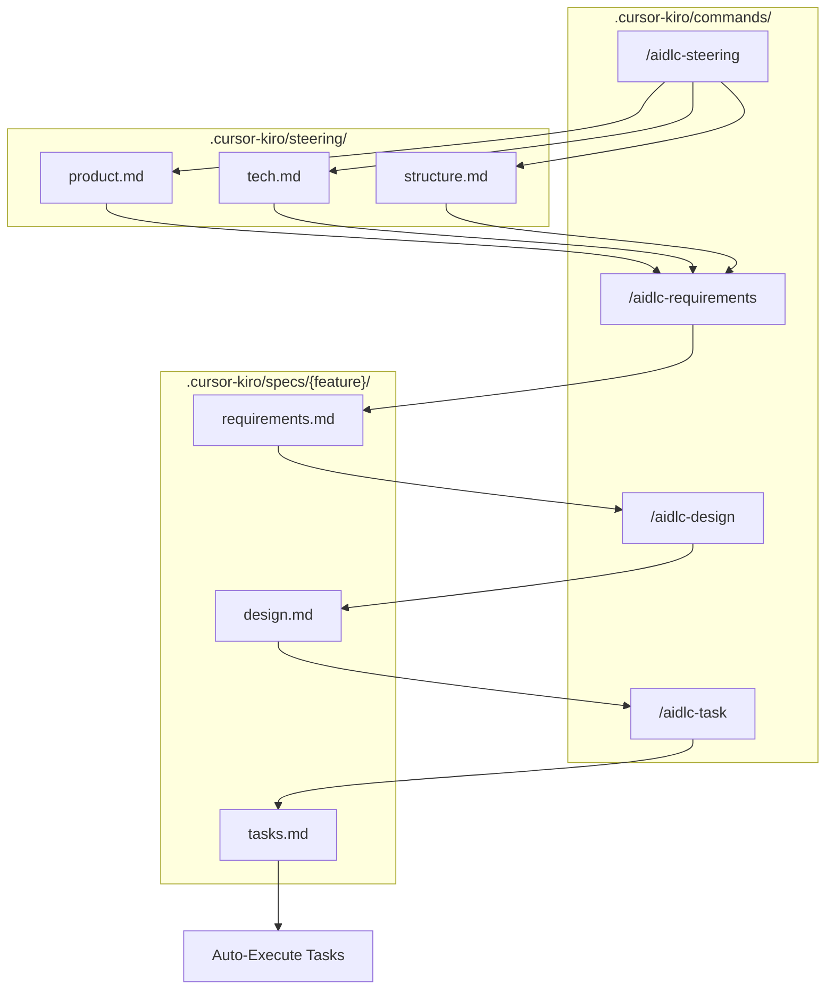
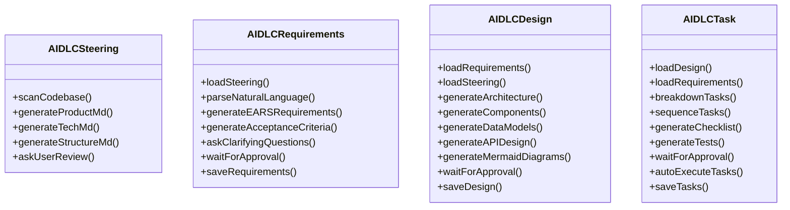
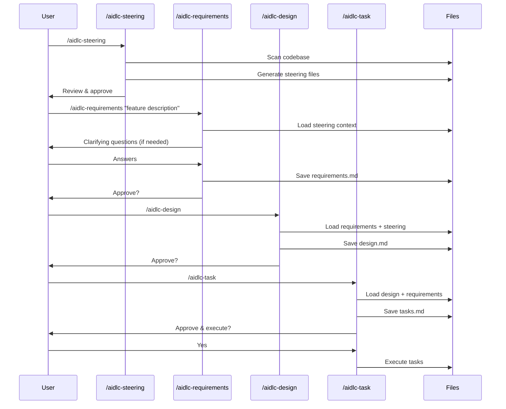

# Design: Kiro-Style Simplified AIDLC

**Feature**: Kiro-Style Simplified Workflow  
**Branch**: path/req-desgin-task-kiro-concept  
**Created**: 2025-12-16  
**Status**: 🔵 In Progress

---

## 1. Architecture Overview



---

## 2. Component Design

### 2.1 Commands Structure



### 2.2 Command Flow



---

## 3. Data Models

### 3.1 Steering Files Schema

#### product.md
```markdown
# Product Context

## Vision
[Product vision statement]

## Goals
- Goal 1
- Goal 2

## User Personas
### Persona 1: [Name]
- **Role**: [role]
- **Goals**: [goals]
- **Pain Points**: [pain points]

## Business Requirements
- BR-001: [requirement]
- BR-002: [requirement]

## Success Metrics
| Metric | Target | Current |
|--------|--------|---------|
| [metric] | [target] | [current] |
```

#### tech.md
```markdown
# Technical Context

## Tech Stack
| Layer | Technology | Version |
|-------|------------|---------|
| Language | [lang] | [version] |
| Framework | [framework] | [version] |
| Database | [db] | [version] |

## Dependencies
- dependency1: ^1.0.0
- dependency2: ^2.0.0

## Coding Conventions
- [Convention 1]
- [Convention 2]

## API Standards
- REST/GraphQL
- Authentication: [method]
- Error format: [format]
```

#### structure.md
```markdown
# Project Structure

## Folder Layout
```
project/
├── src/
│   ├── components/
│   ├── services/
│   └── utils/
├── tests/
└── docs/
```

## File Naming
- Components: PascalCase (e.g., `UserProfile.tsx`)
- Utilities: camelCase (e.g., `formatDate.ts`)
- Tests: `*.test.ts` or `*.spec.ts`

## Module Organization
- [Organization pattern]

## Import Patterns
- Absolute imports from `@/`
- Barrel exports in index.ts
```

### 3.2 Specs Files Schema

#### requirements.md
```markdown
# Requirements: [Feature Name]

## Overview
[Brief description]

## Functional Requirements

### FR-001: [Title]
**WHEN** [trigger condition]
**THEN** system SHALL [expected behavior]

### FR-002: [Title]
**WHEN** [trigger condition]  
**AND** [additional condition]
**THEN** system SHALL [expected behavior]

## Acceptance Criteria
- [ ] AC-001: [criterion]
- [ ] AC-002: [criterion]
```

#### design.md
```markdown
# Design: [Feature Name]

## Architecture
[Mermaid diagram]

## Components
| Component | Responsibility |
|-----------|---------------|
| [name] | [responsibility] |

## Data Models
[Schema or diagram]

## API Design
| Endpoint | Method | Description |
|----------|--------|-------------|
| /api/... | GET | [description] |
```

#### tasks.md
```markdown
# Tasks: [Feature Name]

## Task List

### Task 1: [Title]
**Dependencies**: None
**Estimated**: [time]
- [ ] Step 1
- [ ] Step 2

### Task 2: [Title]
**Dependencies**: Task 1
**Estimated**: [time]
- [ ] Step 1
- [ ] Step 2

## Tests
- [ ] Test: [description]
- [ ] Test: [description]
```

---

## 4. File Templates

### 4.1 Command Template Structure

Each command file follows this structure:

```markdown
# /aidlc-[stage] - [Stage Name]

[Brief description]

## What This Command Does

[Detailed explanation]

## Prerequisites

[What needs to be in place]

## Usage

```
/aidlc-[stage] [arguments]
```

## Output

[What gets generated]

## Example

[Example usage and output]
```

---

## 5. Implementation Files

### 5.1 Files to Create

| File | Purpose |
|------|---------|
| `.cursor-kiro/steering/product.md` | Product context template |
| `.cursor-kiro/steering/tech.md` | Technical context template |
| `.cursor-kiro/steering/structure.md` | Structure context template |
| `.cursor-kiro/commands/aidlc-steering.md` | Steering command |
| `.cursor-kiro/commands/aidlc-requirements.md` | Requirements command |
| `.cursor-kiro/commands/aidlc-design.md` | Design command |
| `.cursor-kiro/commands/aidlc-task.md` | Task command |

---

## 6. Approval

**Design approved**: ✅ Approved (2025-12-16)

---

> **Next Stage**: Task (Code Generation)

